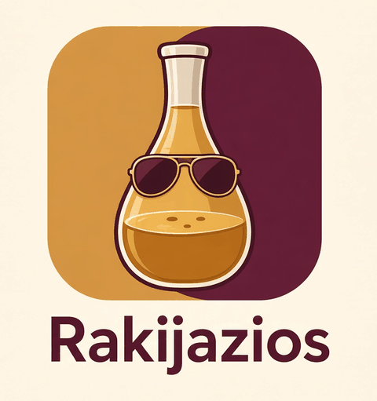

<h1 align="center">
  
</h1>

<p align="center">
  
  
  
  <a href="#contribute"></a>
  <a href="AGENTS.md"></a>
  <a href="LICENSE"></a>
</p>

> [!TIP]
> **⚡ TL;DR in 30 seconds**
> - 🍾 **Rakijazios** = chat where **humans and AI bots** talk together, in **groups** or **private chats**.
> - 🔑 Bots use **your own API key**, or 🖥️ **your own computer's AI** (a local model, no open ports).
> - 🏠 You **host it yourself** with Docker Compose. Sign in with an **email link** (no passwords).
> - 🚀 Start: [Quick start](#quick-start) · 🗺️ Plans: [Roadmap](#roadmap) · 🤝 Help: [Contribute](#contribute)

---

<a id="what-is-it"></a>

## 🍾 What is it?

- **Rakijazios** is a customized, self-hosted **Rakazo** (an open-source app where people and AI bots chat).
- 👥 **Social first:** find people by `@handle` or email, add a profile photo, invite friends with a **link**.
- 🤖 **Bots live with you:** share a **group** with humans *and* bots, or talk 1:1 with a bot.
- 🔑 **Bring your own model:** your API key, or a model on **your own hardware** that your bots can use.
- 📦 This repo (`rakijazios`) holds **our patches** on top of the upstream Rakazo images.

<a id="features"></a>

## ✨ Features

| | Feature | Where |
|---|---|---|
| ✅ | **Magic-link sign-in** (email link, no password) | Sign-in page |
| ✅ | **Profiles**: photo upload, find people by `@handle` / email | Settings → Account |
| ✅ | **Spaces + invite links** (survive sign-in / sign-up) | Share → People & invites |
| ✅ | **Group sharing**: humans + bots in one conversation, owner-controlled | Share → Groups & bots |
| ✅ | **Private chats** with a bot | Sidebar |
| ✅ | **Your own model key** (OpenRouter or any OpenAI-compatible server) | Settings → Models |
| ✅ | **Share your local AI, M1**: a bot answers from the owner's own computer (operator setup) | [runner/](runner/README.md) |
| ✅ | **Rakijazios brand** + translated UI | Everywhere |
| 🚧 | **My hardware (M2a)**: connect a computer from the web in one step | PR #7 |
| 🔮 | Set a password (optional), verified email domain | [Roadmap](docs/roadmap.md) |
| 🔮 | Bot publishing + **marketplace** | [Roadmap](docs/roadmap.md) |
| 🔮 | **Device control** (Browser / Computer toggles) and **Live voice** | PR #8 |

✅ done · 🚧 in progress · 🔮 planned. Full details: [docs/architecture.md](docs/architecture.md#features-in-detail).

<a id="quick-start"></a>

## 🚀 Quick start

> You need **Docker + Compose**, `git`, `openssl` and an **SMTP account** (for the sign-in emails).
> Use **placeholders** below. Never commit real values.

1. 📥 **Get the code and create `.env`** (random secrets are generated for you):
   ```bash
   git clone https://github.com/CarmineMattia/rakijazios.git && cd rakijazios
   bash install-images.sh --local --prepare-only
   ```
2. ✏️ **Edit `.env`**, at least:
   ```dotenv
   WEB_ORIGIN=https://chat.example.com      # the URL people open
   BETTER_AUTH_URL=https://chat.example.com
   API_URL=https://chat.example.com
   RAKAZO_HOST=chat.example.com
   SMTP_URL=smtps://<user>:<password>@<smtp-host>:465
   EMAIL_FROM="Rakijazios <noreply@example.com>"
   OPENROUTER_API_KEY=                      # leave empty: users add their own key
   ```
3. 🔧 **Check 2 host bits** in `docker-compose.override.yml`: the docker group id (`"963"` →
   `getent group docker | cut -d: -f3`), and run `mkdir -p ~/rakazo-local`.
4. ▶️ **Start** (always with **both** compose files, or the patches don't load):
   ```bash
   docker compose --env-file .env -f docker-compose.images.yml -f docker-compose.override.yml up -d
   ```
5. 🔐 **Sign in:** open your `WEB_ORIGIN` → enter your email → click the **magic link**.
6. 🧠 **Connect a model:** **Settings → Models** → add your API key, *or* an OpenAI-compatible URL
   (e.g. Ollama on the host: `http://host.docker.internal:11434/v1`).
7. 🖥️ **Share your computer's AI** (optional):
   - ✅ today: the operator path in [runner/README.md](runner/README.md);
   - 🚧 soon (PR #7): **Settings → My hardware → Add a computer** → paste one command.

<details>
<summary>📖 More: every env var, HTTPS, firewall, troubleshooting</summary>

- Full guide: **[docs/self-hosting.md](docs/self-hosting.md)**
- How patches and overlays work: [docs/architecture.md](docs/architecture.md)
- Running the live stack, testing, known limits: [docs/operations.md](docs/operations.md)
- ⚠️ No SMTP = no sign-in (there's no dev mailbox in this production setup).
- ⚠️ Plain `bash install-images.sh` starts **without** our patches. Use step 4.

</details>

<a id="roadmap"></a>

## 🗺️ Roadmap

| | Item | One line | Details |
|---|---|---|---|
| ✅ | **M1** Local AI prototype | A bot answers from its owner's computer via an outbound runner | [share-local-ai §10](docs/share-local-ai.md#10-implementation-plan) |
| 🚧 | **M2** Pairing UI + grants | M2a My hardware (PR #7) → M2b pick a computer per bot → M2c shared groups | [share-local-ai §10](docs/share-local-ai.md#10-implementation-plan) |
| 🔮 | **M3** Limits & usage | Fair-use limits and usage numbers for shared hardware | [share-local-ai §10](docs/share-local-ai.md#10-implementation-plan) |
| 🔮 | **M4** Marketplace tie-in | Public bots that can run on shared hardware | [share-local-ai §10](docs/share-local-ai.md#10-implementation-plan) |
| 🔮 | **M5** Device node app | Desktop/phone app: chat + one-click local model + built-in runner | [share-local-ai §13](docs/share-local-ai.md#13-vision-rakijazios-app-as-a-device-node-m5) |
| 🔮 | **Bot marketplace** | Publish bots, find them, add them to your chats | [roadmap](docs/roadmap.md#bot-marketplace) |
| 🔮 | **Device control mode** | 🌐 Browser + 🖥️ Computer toggles, opt-in, every action approved on the device | PR #8 |
| 🔮 | **Live voice mode** | Click a bot's avatar → it greets you and you talk live | PR #8 |

Full list (incl. password flow, email domain, bot visibility): **[docs/roadmap.md](docs/roadmap.md)**.

<a id="contribute"></a>

## 🤝 Contribute

- 💡 **Idea or bug?** Open an **issue**. For roadmap ideas, title it `Roadmap: <idea>` and describe
  the **problem**, your **proposal** and any **risks**.
- 🔀 **Code or docs?** Open a **PR to `main`**. Small and focused beats big. **Only the owner merges.**
- 🌿 **Branch names:** `feat/<topic>`, `fix/<topic>`, `docs/<topic>`.
- 🧪 **QA flow:** every PR says **what changed** and **what to test** → a tester (human or our QA bot)
  re-tests → the owner reviews and merges.
- 📐 **Design first** for big things: a doc in [`docs/`](docs/) with an **Open questions** list
  (example: [share-local-ai.md](docs/share-local-ai.md)).

<details>
<summary>✅ PR checklist</summary>

- [ ] One topic per PR; the description explains **what** and **why**.
- [ ] No secrets: no `.env`, keys, tokens, `credentials.json`, real emails or passwords.
- [ ] Typecheck + tests pass (commands in [AGENTS.md](AGENTS.md#build-typecheck-test)).
- [ ] DB changes are **additive** only.
- [ ] Docs updated (README if user-facing, `docs/` for details).
- [ ] A short **"what to test"** list for QA.

</details>

<a id="for-ai-coding-agents"></a>

## 🤖 For AI coding agents

Grok, Claude, Codex, and our own **Rakijazios bots**: start with **[AGENTS.md](AGENTS.md)**. It
has the project map, exact commands and the **hard rules** (no secrets, backups, no merging).

<a id="security"></a>

## 🔒 Security

- 🚫 **Never commit `.env`**, API keys, tokens or `credentials.json`. **This repo is public.**
- 🔑 No shared default API key: each user brings their own.
- 🕵️ **Found a vulnerability?** Please **don't open a public issue**. Use GitHub's **private
  vulnerability report** (Security tab → *Report a vulnerability*) or contact
  [@CarmineMattia](https://github.com/CarmineMattia) privately.

<a id="docs"></a>

## 📚 Docs

| 📄 Doc | What's inside |
|---|---|
| [docs/self-hosting.md](docs/self-hosting.md) | Full install guide, env vars, models, local AI |
| [docs/architecture.md](docs/architecture.md) | Repo layout, patches + overlays, features in detail, API |
| [docs/operations.md](docs/operations.md) | Live stack, deploys + backups, tests, known limits |
| [docs/roadmap.md](docs/roadmap.md) | Full roadmap |
| [docs/share-local-ai.md](docs/share-local-ai.md) | Share-your-local-AI design (M1–M5) |
| [runner/README.md](runner/README.md) | The local runner |
| [AGENTS.md](AGENTS.md) | Guide for AI coding agents |

<a id="license"></a>

## 📜 License

- ⚖️ **Apache-2.0**: see [LICENSE](LICENSE) and [NOTICE](NOTICE). © 2026 Carmine Mattia.
- 🙏 **Thanks to [Rakazo](https://github.com/elie222/rakazo)** and its contributors. Rakijazios is
  a customized distribution of Rakazo (also Apache-2.0); files under `patches/` are modified
  Rakazo files and keep their upstream copyright notices.
