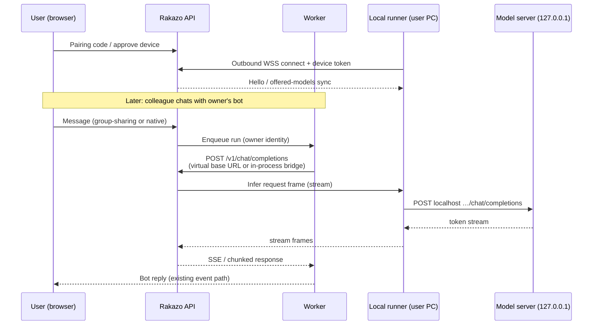

# Share your local AI — technical design

Status: **design only** (not implemented).  
Related roadmap: README → Roadmap → Share your local AI / Bot marketplace / Device node app (M5).  
Audience: implementers of `rakazo-online` overlays and any future upstream contribution.

## 1. Problem

Users already run capable models on their own machines (Ollama, llama.cpp, LM Studio, any OpenAI-compatible server bound to `127.0.0.1`). Today Rakazo can talk to a **deployment-wide** local server (`RAKAZO_LOCAL_MODELS_URL`, keyless `local` provider) or to a **per-user OpenAI-compatible credential** whose `baseUrl` the worker must reach directly.

Neither path lets user A safely offer *their* laptop GPU to bots that user B talks to in a shared group:

- A remote user's `http://127.0.0.1:11434` is not reachable from the Host-002 worker.
- Opening inbound ports or Cloudflare tunnels is the wrong default for non-technical users.
- The existing OpenAI-compatible URL allowlist deliberately rejects most public and DNS-to-private hostnames (SSRF defense). So "just paste your home IP" is both insecure and often blocked by policy.

**Goal:** any user can install a small local runner with one command, pair it to their Rakazo account, and offer selected models as the backend for *their* bots (including bots used in shared groups). Inference runs on their hardware. V1 shares **only** model inference — no files, shell, or computer access on the sharer's machine.

## 2. Agreed principles

1. **Outbound-only runner.** The runner opens a long-lived connection *out* to Rakazo (WebSocket over HTTPS, or HTTPS long-poll fallback). No open ports, no tunnels.
2. **Localhost only for the model.** The runner is the only process that talks to the model server, and only at a configured loopback/private address.
3. **Owner controls.** Which models are offered, which bots/groups may use them, concurrency and per-person rate limits, on/off, revoke/unpair, rotatable device tokens.
4. **V1 = inference only.** Chat completions (streaming). No tool/computer/file bridging through the runner.
5. **Transparency.** Consumers see that a bot runs on someone else's hardware. Sharers are told their model sees group messages.
6. **Marketplace later.** A published bot may be backed by a shared local model (M4).

### 2.1 Decisions (recorded 2026-10-08)

**D1 — Runner offline ⇒ the reply fails; no automatic fallback model.**  
If the sharer's runner is offline (or drops mid-run), the bot run fails fast and the user sees a
clear notice in the chat, e.g. *"{Bot} runs on {owner}'s computer, which is offline right now.
Try again later."* Rakijazios does **not** silently switch to another model (cloud or deployment).
Reasons: no surprise bills, no surprise data flows to a third-party provider, and the
"runs on {owner}'s hardware" promise stays true. This closes **O4**.

**D2 — Onboarding: no deployment default model.**  
New users connect **their own** model: an API key (OpenRouter, Anthropic, Groq, …), an
OpenAI-compatible server, or the hardware Rakijazios is installed on (the operator's local models).
Carmine's personal key (or any operator key) is **never** used as a default for other users.
Today this matches the code path: `needsModel` stays true until the user has a default
`space_model_preferences` row, because `PI_DEFAULT_PROVIDER=openai-compatible` yields no
`deploymentModelKey` (`router.ts` `modelSetup`, `deployment-model.ts`).

*Possible future UX improvement (optional, not committed):* a **"Connect with OpenRouter"** button
using OpenRouter's OAuth PKCE flow (`https://openrouter.ai/auth` → `POST /api/v1/auth/keys`), so each
user gets their **own** OpenRouter key without copy-pasting; it would be stored like any pasted key in
`user_model_credentials` (provider `openrouter`). A free OpenRouter account is enough for `:free`
models (account-wide free-model limits apply), but a key is always required: an unauthenticated
`POST https://openrouter.ai/api/v1/chat/completions` with a `:free` model returned **HTTP 401**
("No cookie auth credentials found") when verified on 2026-10-08.

## 3. What the code already does (facts from Host-002)

Inspected against the running image stack and `rakazo-online` patches (2026-10-08).

### 3.1 Credentials and preferences

| Table | Scope | Role |
|---|---|---|
| `user_model_credentials` | **per user** (`userId`) | One row per connected provider (`openrouter`, `openai-compatible`, …). Points at an encrypted `secretId`. |
| `space_model_preferences` | **per space member** (`spaceId` + `userId`) | Links a credential to a `modelId`, optional `isDefault`. Free-form model ids for `openai-compatible` must appear here to validate. |
| `secrets` | credential secrets loaded with `spaceId: null` (user-scoped) | For `openai-compatible`, plaintext is a structured secret: `{ kind: "openai_compatible", baseUrl, apiKey?, reasoning?, … }` (`model-connect.ts` / `pi-oauth` parse). |

Surprising but useful: **OpenAI-compatible credentials are already per-user, not per-space.** Space prefs only choose which credential/model is active in that space. A "share my hardware" feature can hang off the same user.

### 3.2 How a bot run picks a model

In `packages/adapters/src/executor.ts`:

1. `selectConfiguredModel` prefers the bot's `modelProvider`/`modelId` when a matching credential (or keyless `local` catalog entry) exists; else the space default credential; else deployment defaults (`PI_DEFAULT_PROVIDER` / `OPENROUTER_API_KEY`, etc.).
2. `resolveModelKey` loads the credential secret for **`run.userId`** (the bot owner). For `openai-compatible` it extracts `baseUrl` from the secret.
3. `pi-runtime.ts` calls `registerOpenAiCompatibleRuntime` when `provider === openai-compatible` and `request.model.baseUrl` is set — the worker then streams OpenAI-compatible chat completions to that base URL via a hardened fetch (`createOpenAiCompatibleFetch`).

Shared group sends (`group-sharing.ts` → `thread-target.ts`) already set execution identity to the **group owner**. Usage rows observed in the live e2e (`usage_records.userId` = owner) match that. So if the owner's bot is backed by a shared-local credential, colleagues talking in a shared group already hit the owner's model path without further ACL changes for *who pays / whose key*.

### 3.3 Local models on this host today

- Deployment env (api/worker): `RAKAZO_LOCAL_MODELS_URL=http://host.docker.internal:11434/v1`, `RAKAZO_LOCAL_MODELS=gemma4:26b-…,…`, `PI_DEFAULT_PROVIDER=openai-compatible`.
- Keyless catalog provider id: **`local`** (`pi-local-provider.ts`). Bot `Chief` uses `local` / `gemma4:26b-a4b-it-q4_K_M`.
- Owner also has an `openai-compatible` credential with preference model `hermes-gemma4-e4b:latest`.
- Ollama on Host-002 `:11434` serves those models; containers reach it via `host.docker.internal` (HTTP 200 from api).

The `local` provider is **one server per deployment**, configured by the operator. It is not multi-tenant "each user brings a machine."

### 3.4 Why a raw remote baseUrl is not enough

`openai-compatible-url.ts` + `createOpenAiCompatibleFetch`:

- Allow loopback, `*.localhost`, `host.docker.internal`, and literal private IPs.
- Block cloud metadata / link-local.
- By default **reject public hosts** (`RAKAZO_OPENAI_COMPAT_ALLOW_PUBLIC` must be `1` to allow).
- For a non-allowlisted hostname that resolves to a *private* address, the lookup throws ("Public model server hostname resolved to a private address").

Implications for this design:

- A friend's home IP or hostname will not work under default policy (good).
- Even an **internal** URL like `http://api:3100/api/…/v1` is awkward: hostname `api` is not in the private-hostname set, and Docker DNS resolving it to a private IP trips the "public hostname → private address" guard.  
  → A virtual proxy URL must either live on an allowlisted hostname (`127.0.0.1` / `host.docker.internal`), use a dedicated provider id with a controlled fetch, or talk to the runner session manager in-process. **Open question O1.**

## 4. Architecture



### 4.1 Components

1. **Local runner** (new binary or Node CLI, installable via one curl|sh or `npx`).  
   - Config: Rakazo base URL, device token (after pairing), model base URL (default `http://127.0.0.1:11434/v1`), optional allowlist of model ids.  
   - Responsibilities: maintain outbound session, advertise models (`GET /v1/models` locally), execute inference requests, enforce localhost-only dial, cancel on disconnect.

2. **Runner gateway** (new module in api, sticky to one replica or via Redis pub/sub).  
   - Accepts runner WebSocket (or long-poll).  
   - Maps `deviceId` → live connection.  
   - Exposes an **OpenAI-compatible surface** to workers (recommended shape below) or an in-process bridge the worker calls.

3. **Control plane** (HTTP + DB).  
   - Pairing codes, device tokens, offered models, grants, limits, audit.  
   - Settings UI: **Settings → My hardware**.

4. **Credential façade.**  
   When a user enables a shared-local model for a bot, create/update a `user_model_credentials` row with a new provider id (proposal: `shared-local`) *or* an `openai-compatible` secret whose `baseUrl` points at the virtual proxy. Bot `modelProvider`/`modelId` then flow through the existing executor path. Prefer a **distinct provider id** so SSRF rules and UX labels stay explicit (**O1**).

### 4.2 Recommended routing shape (worker → model)

**Preferred for V1:** provider `shared-local` registered in `pi-runtime` like openai-compatible, but `fetch` is a custom dispatcher that:

1. Parses `baseUrl` as `shared-local://{deviceId}` (or `http://shared-local/{deviceId}/v1` only understood by our fetch).
2. Looks up the gateway connection for `deviceId`.
3. Forwards `POST …/chat/completions` (and optionally `GET …/models`) over the runner protocol.
4. Never performs a DNS lookup to user-controlled hosts.

Workers do not need to reach the user's LAN. Api (or a dedicated gateway service) holds the WebSocket; if api is multi-instance, use Redis to route request frames to the instance that owns the socket (**O2**).

**Alternative:** HTTP reverse proxy on `http://127.0.0.1:<worker-sidecar>/v1/...` — more moving parts on Host-002; only worth it if we must avoid a custom provider.

## 5. Runner protocol (draft)

Transport: **WebSocket** `wss://{WEB_ORIGIN}/api/local-runners/ws` (cookie-less; device token in first frame or `Authorization: Bearer`). Fallback: HTTPS long-poll `/api/local-runners/poll` if WS is blocked (**O3**).

### 5.1 Auth & pairing

1. User opens **Settings → My hardware → Add device** → API creates `local_runner_devices` row + one-time **pairing code** (6–8 chars, TTL ~10 min) and shows it.
2. Runner started with `rakazo-runner pair --code ABCD-EFGH` (or env).  
   `POST /api/local-runners/pair { code, deviceName, publicKey? }` → returns **device token** (opaque, stored hashed) + `deviceId`. Code is single-use.
3. Runner persists token locally (`~/.config/rakazo-runner/credentials.json`, mode 0600).
4. Connect: first message `{ type: "hello", deviceId, token, runnerVersion, offeredModels: [...] }`. Server validates hash, sets device `lastSeenAt`, replaces any previous connection for that device (single active session).
5. **Rotate:** user can revoke token; runner must re-pair. Optional refresh tokens later.

### 5.2 Framing

JSON text frames (binary reserved for future). Every request-carrying frame has `id` (ulid).

| Direction | Type | Purpose |
|---|---|---|
| C→S | `hello` | Auth + initial model catalog |
| C→S | `heartbeat` | Every 15s; server may reply `heartbeat_ack` |
| C→S | `models` | Push catalog change `{ models: [{ id, maxContext? }] }` |
| S→C | `infer.request` | `{ id, model, body }` where `body` is OpenAI chat-completions JSON (stream=true) |
| C→S | `infer.chunk` | `{ id, data }` — raw SSE line or JSON delta (choose one; prefer **passthrough SSE lines** to minimize translation) |
| C→S | `infer.done` | `{ id, status, usage? }` |
| C→S | `infer.error` | `{ id, message, retryable }` |
| S→C | `infer.cancel` | `{ id }` |
| S→C | `policy` | `{ maxConcurrent, allowedModels, enabled }` |
| S→C | `bye` | Server revoke / maintenance |

**Cancellation:** gateway cancels when the worker aborts the run (existing run cancel path). Runner aborts the localhost fetch via `AbortSignal`.

**Timeouts:** gateway-side idle timeout per request (e.g. 10 min hard cap, configurable). Heartbeat miss (e.g. 45s) → mark device offline, fail in-flight infers.

**Backpressure:** max in-flight infers per device (owner setting, default 1–2). Excess requests queue briefly then fail with `429`-equivalent so the worker can surface a clean error. Do not unbounded-buffer token streams in the api.

### 5.3 Localhost dial rules (runner)

- Default allowlist: `127.0.0.1`, `::1`, `localhost`.  
- Optional explicit override in runner config for `host.docker.internal` / LAN IP — **off by default**, warn in UI.  
- Reject redirects, reject non-http(s), no proxy env for model calls.  
- Mirror server-side SSRF spirit: never follow user-supplied URLs from the infer payload (model server URL is local config only).

## 6. Data model (additive)

Proposed tables (names indicative):

```text
local_runner_devices
  id, userId, name, tokenHash, status (paired|revoked),
  runnerVersion, lastSeenAt, createdAt, updatedAt

local_runner_models
  id, deviceId, modelId, advertisedContext?, enabled,
  unique(deviceId, modelId)

local_runner_grants
  id, userId (owner), deviceId, scopeType (bot|group|space|all_my_bots),
  scopeId nullable, createdAt
  -- V1 can start with "all bots owned by userId on this device" and add finer grants in M2

local_runner_limits
  deviceId PK,
  maxConcurrent, perUserPerMinute, dailyTokenCap nullable, enabled bool

local_runner_usage
  id, deviceId, ownerUserId, consumerUserId, botId, runId,
  inputTokens, outputTokens, createdAt
```

Pairing codes: short-lived rows or Redis keys `pair:{code} → userId`.

**Credential link:** either store `deviceId` + `modelId` inside a `shared-local` secret, or generate a synthetic preference when the user assigns the model to a bot. Do **not** put the device token in the worker-visible secret.

## 7. Security / threat model

| Threat | Mitigation |
|---|---|
| Stolen device token | Hash at rest; rotate/revoke in UI; bind to deviceId; optional sender IP rate limit on WS hello |
| Malicious Rakazo server → runner | Runner only dials configured localhost model URL; never executes shell; ignore tool-call payloads in V1 (chat completions only) |
| Malicious sharer sees private chats | **Disclose** in UI before join/share; only bots the owner configures use the device; grants limit which shared groups; document that message text is sent for inference |
| Peer abuse (spam owner's GPU) | Per-consumer rate limits, concurrency, owner kill switch, usage dashboard |
| SSRF via model URL | Runner localhost policy; server never fetches user URLs for this path |
| Prompt injection via shared group | Same as today's owner-model sharing; no new computer surface in V1 |
| Token stream hijack on LAN | WSS to Rakazo; device token over TLS; no inbound port |
| Cross-tenant device mixup | Every infer frame server-side authorized: run.userId must own device; grant must allow bot/group |

V1 **does not** grant file/command/computer access. Computer sandbox stays on Rakazo's computer containers under the bot owner as today.

## 8. UX

**Settings → My hardware**

- List devices (online/offline, last seen, models, limits, revoke).
- **Add device:** show pairing code + one-liner install (`curl -fsSL … \| sh` or `npx @rakazo/runner pair`).
- Per device: toggles for offered models, max concurrency, per-user rate, master enable.

**Bot model picker**

- Section "On my computer" listing online offered models.  
- Subtitle: **Runs on {deviceName} ({owner display name})**.  
- If offline: disable selection or show a warning. No fallback model (**D1**).

**Shared group / People panel**

- Badge on bots that use shared-local: "Reply computed on {owner}'s computer".  
- First-time grant toast for the sharer: "People in this group will send messages to your model for replies."

**Transparency for consumers** is mandatory before marketplace publish (M4).

## 9. Failure modes

| Case | Behavior |
|---|---|
| Runner offline | Run fails fast with a clear notice to the user in the chat ("{owner}'s computer is offline"). **No automatic fallback model** (**D1**) |
| Slow / overloaded | Timeouts + 429 from gateway; bot message explains retry |
| Mid-stream disconnect | Cancel run; partial assistant text follows existing partial-failure handling if any |
| Model id unknown on device | `infer.error`; owner should refresh catalog |
| Revoke during run | `bye` + cancel in-flight |

## 10. Implementation plan

### M1 — Same-host prototype (owner only)

- Runner binary + outbound WS to api; dial local Ollama (`127.0.0.1:11434` or Host-002's existing server).
- Gateway in api; `shared-local` provider wired in worker for **one** test bot owned by the operator.
- No pairing UI yet: seed device token via CLI against the operator account.
- **Tests:** unit protocol codec; integration with Ollama on Host-002; one headless chat producing a real reply through the runner (not direct `host.docker.internal`).
- **Success:** `Chief` or a clone answers via runner while tcpdump shows no inbound port to the runner.

### M2 — Pairing UI + grants

- Settings → My hardware, pairing code flow, revoke/rotate.
- Assign offered models to bots; grants for shared groups.
- Transparency copy in Share / group UI.
- **Tests:** Playwright/puppeteer pairing; second user in shared group triggers owner's runner; revoke mid-session.

### M3 — Limits & usage

- Concurrency, per-user rate, daily caps; `local_runner_usage` + simple Settings chart.
- Backpressure and timeout tuning from M1 load.
- **Tests:** abuse script hits 429; usage rows match `usage_records` / run ids.

### M4 — Marketplace tie-in

- Published bot may declare `shared-local` backend requirements (min VRAM text, model id).
- Consumers see "Requires {owner} online" / "Runs on publisher's hardware".
- Depends on bot marketplace design; keep interfaces stable from M2.

### M5+ — Device node app (long-term vision)

- Installable Rakijazios app that bundles chat client + one-click local model + runner. See §13.

Each milestone ships behind a feature flag / deployment setting so Host-002 can enable without exposing unfinished UI.

## 11. Open questions

| Id | Question | Notes |
|---|---|---|
| **O1** | Provider id + how the worker reaches the gateway | Custom `shared-local` fetch vs virtual HTTP URL on allowlisted host. SSRF rules make naïve `http://api:3100/...` problematic. |
| **O2** | Multi-instance api sticky sessions | Single Host-002 replica is enough for M1–M2; Redis routing needed before HA. |
| **O3** | Long-poll fallback | Implement only if real users hit WS blocks. |
| **O4** | ~~Automatic fallback model when offline~~ | **Decided (D1):** no fallback; the reply fails with a clear notice. |
| **O5** | Stream framing: SSE passthrough vs normalized JSON deltas | Passthrough is less work and matches openai-compatible clients. |
| **O6** | Should `local` (deployment) and `shared-local` (per-user) share code? | Likely share OpenAI wire format helpers; keep catalog/auth separate. |
| **O7** | Billing / fair use | V1 = owner's electricity; marketplace may need quotas or "bring your own runner". |
| **O8** | Mobile runners | Out of scope for V1; desktop OS first (Linux/macOS/Windows). Long-term view in §13. |

## 12. Non-goals (V1)

- Sharing the Rakazo **computer** sandbox or host filesystem through the runner.
- Running arbitrary containers on the sharer's PC.
- Replacing OpenRouter / cloud providers.
- Changing group-sharing ACLs beyond disclosing hardware location.

## 13. Vision: Rakijazios app as a device node (M5+)

Status: **long-term vision**, not scheduled. Builds on the runner (M1–M3); nothing here changes V1.

### 13.1 What the app is

One installable **Rakijazios app** per device:

- **Desktop:** Linux, Windows, macOS — e.g. Tauri or Electron wrapping the existing web UI.
- **Mobile:** Android and iOS.

The app combines three things:

1. **Chat client** — the normal Rakijazios UI (groups, private chats, bots).
2. **One-click local model** — bundled llama.cpp (or equivalent); the app picks a model that fits the
   device's RAM/VRAM, downloads it and runs it. Quantisation, context size and ports stay hidden;
   the user sees "Local model: ready".
3. **The runner** — the same outbound-only runner from §4–§5, built in. It pairs the device with a
   Rakijazios server and offers the local model to the user's bots.

### 13.2 Devices as nodes, groups as an "army" of bots

Each paired device becomes a **node** that runs its owner's bots. A group can then mix humans and bots
whose replies are computed on different hardware: Alice's laptop bot, Bob's desktop GPU bot, the
server's own local model and a cloud-key bot all in one conversation, each labelled with where it runs.

"Pooling RAM" means **many bots on many devices collaborating in a group** (each bot a whole model on
one device). It does **not** mean sharding one large model across devices over the internet:
layer/tensor-parallel inference needs low-latency, high-bandwidth links, and over home connections it
would be far too slow to be useful.

### 13.3 Feasibility (realistic)

| Platform | Role | Notes |
|---|---|---|
| Desktop (Linux/Windows/macOS) | Full node | Very feasible. llama.cpp runs well on CPU, Apple Silicon and consumer GPUs; the app can stay in the tray and keep the runner connected. |
| Android | Chat client + light node | Only small models (≈1–4B quantised). Battery and thermal throttling; background execution is restricted, so serving only while the app is in the foreground (or charging, by user choice). |
| iOS | Chat client + light node (foreground only) | Small models only; iOS suspends background apps, so the device can serve only while the app is open. Treat phones mainly as chat clients. |

### 13.4 Security

Same model as the runner (§7):

- **Inference-only by default.** No files, shell, camera, contacts or computer access through the node.
- **Explicit grants** for which bots/groups may use the device; owner limits, kill switch, revoke.
- **Transparency:** consumers see "runs on {owner}'s {device}"; owners are told their model sees the
  group messages it answers.
- Outbound-only connection; no listening ports on the device.
- Model files and the app itself must be integrity-checked (signed builds, checksummed model downloads).

### 13.5 Open questions

| Id | Question |
|---|---|
| **N1** | App framework: Tauri (small, Rust) vs Electron (mature, heavy) on desktop; native vs React Native / Capacitor on mobile. |
| **N2** | Model distribution and licensing: which models may be bundled or auto-downloaded (license terms, attribution, acceptable-use flow-down), and where to host them. |
| **N3** | Auto-updates for the app, the bundled inference engine and models (signing, rollbacks). |
| **N4** | Store policies: Apple App Store / Google Play rules on downloading and executing models after install, app size, and background work. |
| **N5** | NAT-free connectivity: outbound WSS from every device (as in §5); behaviour on flaky mobile networks and captive portals. |
| **N6** | Node discovery and scheduling: how the server picks a device for a bot (owner preference, online status, capacity), and how groups behave when several nodes are offline (see **D1**: fail clearly, no silent fallback). |

## 14. References (code touchpoints)

- `packages/adapters/src/pi-openai-compatible-provider.ts` — runtime registration, hardened fetch  
- `packages/adapters/src/openai-compatible-url.ts` — SSRF / private-host policy  
- `packages/adapters/src/pi-local-provider.ts` — deployment-wide local catalog  
- `packages/adapters/src/model-selection.ts` / `model-connect.ts` / `executor.ts` — credential resolution  
- `packages/db/src/model-credentials.ts` — `findModelCredential` scope  
- `packages/contracts/src/openai-compatible-ui.ts` — connect form helpers  
- `patches/api/group-sharing.ts` + `thread-target.ts` — shared sends as owner  
- Host-002: Ollama `:11434`, env `RAKAZO_LOCAL_MODELS_*`

